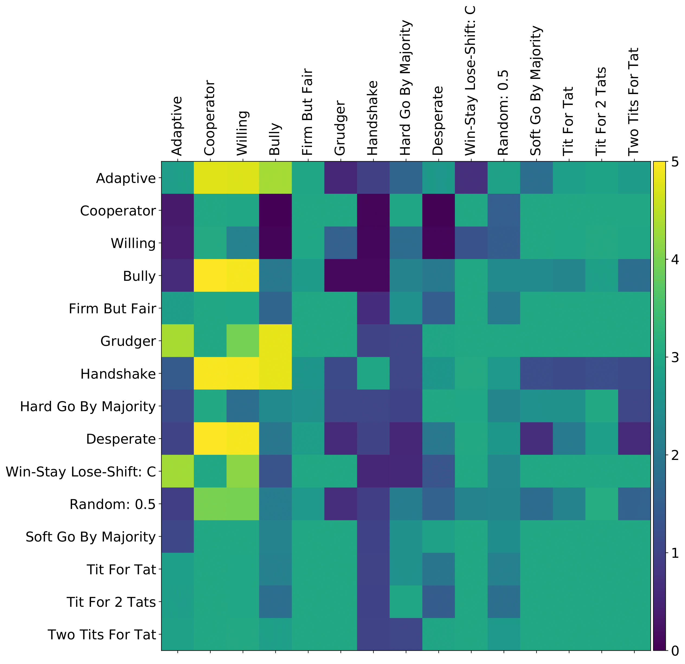
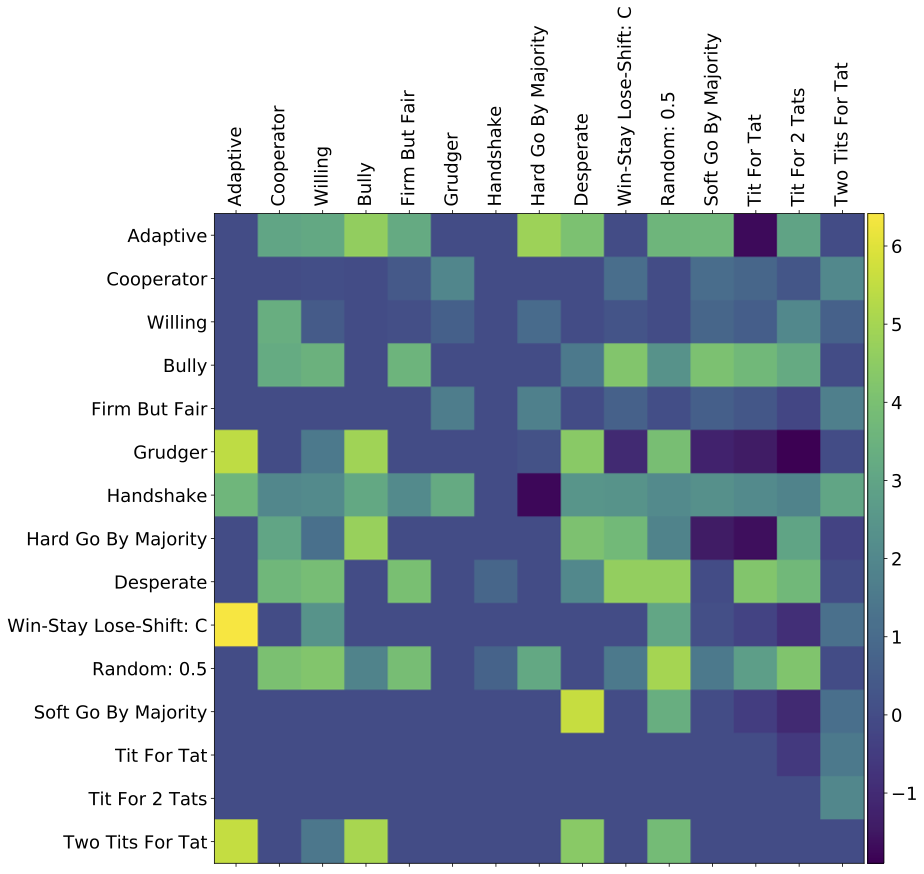
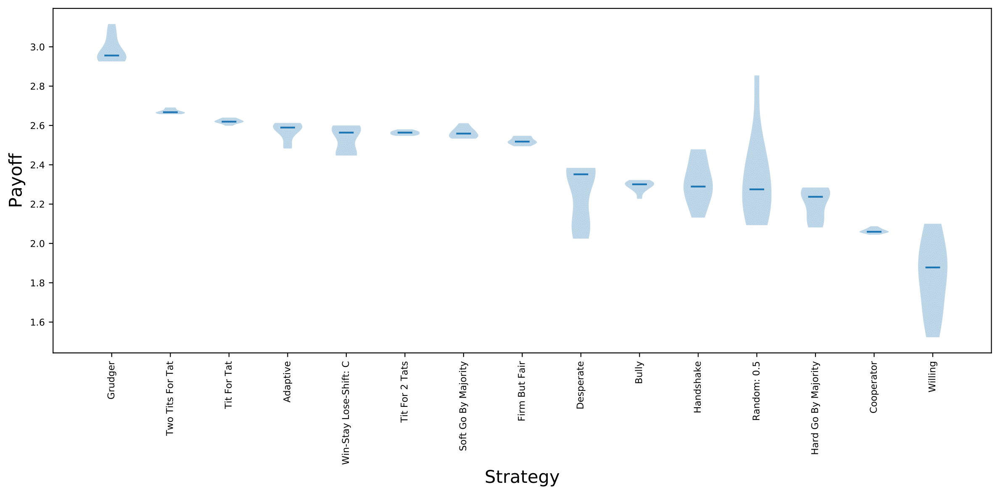
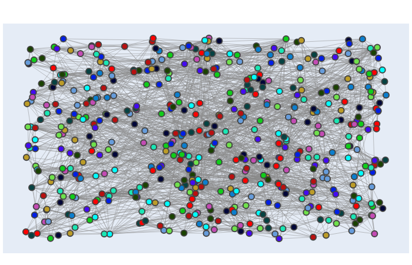
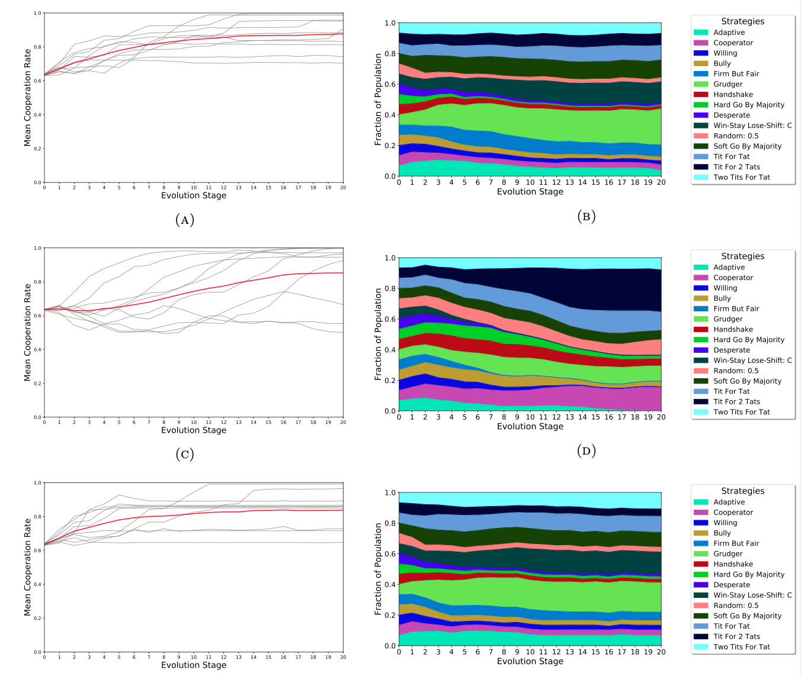

# Overview

In this research, a comprehensive exploration of the dynamics of the Prisoner's Dilemma (PD) within the context of neural networks was conducted, with a specific focus on the evolution of strategies when agents possess the flexibility to switch strategies. While fundamental applications of the PD yield valuable insights, it was ventured into a more intriguing dimension, where the study centered on how repeated PD scenarios transform when agents have the capacity to dynamically alter their strategies. 

An emmergence of cooperation is not only verified but found necesary for players to survive.

# [Article](prisoners-dilemma-networked-populations.pdf)

In this project we study how the set of used strategies evolves when
players are allowed to change strategy between different tournaments.

## Procedure
Strategies keep two types of scoring: A primary scoring, based on the payoffs of the Prisoner’s Dilemma, that determines who wins a certain tournament. A secondary scoring, based on the Elo rating system.

## Preliminary Strategies

From an extensive list of strategies studied in the PD literature, a
selection of **15** strategies were chosen, considering historical
importance, simplicity, and variation in type (ie non retaliation,
adaptive, heuristic, group strategies, and Tit-for-Tat variants).

### Payoffs

Each match-up results in a payoff for each two competing strategies. 

Each payoff is highly dependent on the dynamic of the opponents and one can construct a **mean** heatmap payoff matrix (higher/brighter is better).

  
&nbsp; &nbsp; &nbsp; &nbsp;
  

The **variance** of the payoff for each strategy can help to provide preliminary insights:

  
&nbsp; &nbsp; &nbsp; &nbsp;

## Evolving Strategies

For each simulation it was considered the interaction between 35 players for each of the 15 strategies (525 nodes):

  
&nbsp; &nbsp; &nbsp; &nbsp;

They follow the 3 possible paths:

   $$P(s_A \to s_B) = \frac{1}{1 + 10^{\frac{R_A-R_B}{400}}}$$

   $$P(s_A \to s_B) = \frac{1}{2}$$

   $$P(s_A \to s_B) =\left\\{
   \begin{array}{ll}
    0    ,& R_A > R_B , \\
    1    ,&  R_A < R_B .
   \end{array}
   \right.$$

And we're interested in answering the following questions:

**Q1** - Survivors: What are the surviving strategies? Do they match the winners found in the Preliminary Analysis?

**Q2** - Cooperation: Is Cooperation or Defection favoured by surviving strategies? How does the Mean Cooperation Rate vary?

**Q3** - PD Score vs Elo Rating: How does the Elo rating and the PD payoffs fare in comparison on deter- mining the final (stationary) fraction of the population for each strategy?

**Q4** - Dominance of Global Winners: Do the global winners (such as defined in § 5.1.4) dominate the net- work when subject to the Elo rating?

## Results

The Mean Cooperation Rate generally increses and the surviving strategies evolute their populations to a steady state - Beautiful!

  
&nbsp; &nbsp; &nbsp; &nbsp;

